# eKYC Process Tool Plugin

- eKYC (electronic Know Your Customer) is the automated process through which companies can perform customer identity verification digitally.
- We created a plugin that allows everyone to create their own eKYC process in Joget.

### Sample Joget App

- Example of Joget App that implements our EKYC plugin - [`eKYC Demo App`](src/APP_EKYC_Demo_App-1-20240129181351.jwa)
- Sample App created by [`JordieYen`](https://github.com/JordieYen)

## Plugin Installation & Usage Guide

1.  Download and import [`joget-ekyc-v1.0.jar`](https://drive.google.com/file/d/1l33kHHcy6rc7kU5fdBbfxSd9tuhLJp2t/view?usp=sharing) into Joget (Hopefully will be contributed to [Joget Marketplace](https://marketplace.joget.org/jw/web/userview/mp/mpp/_/aa) in future).
2.  You can do this by heading over to `Settings > Manage Plugins`; Click on `Upload Plugin` to upload the `.jar` file.

    | 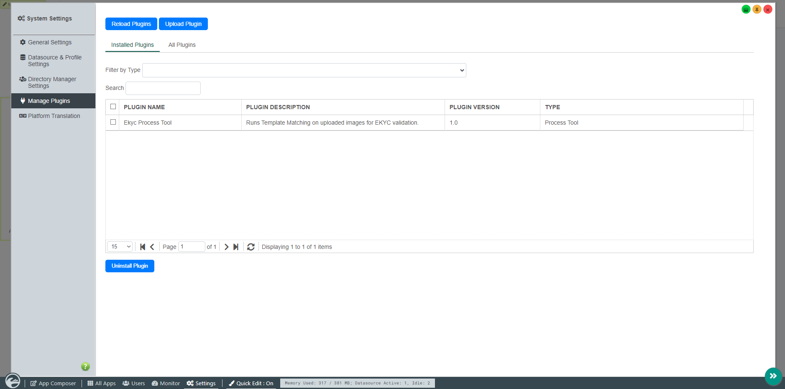 |
    | :---------------------------------------------: |
    |                    figure 1                     |

3.  In **App Composer**, you will need to create **2 forms**, the `User Input Form` and the `eKYC Templates Form`.

    - ## User Input Form

      The purpose of this form, `User Input Form`, is for users to upload their document to run eKYC verification on.

      | 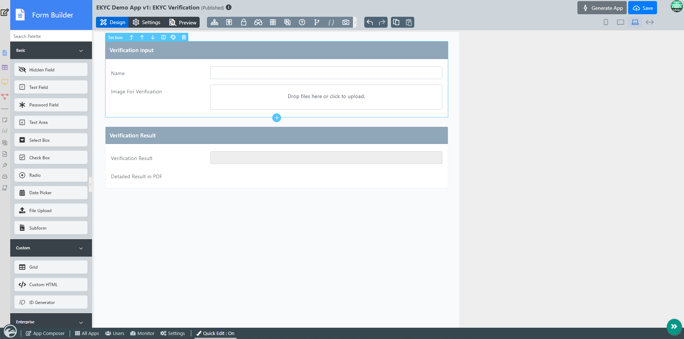 |
      | :------------------------------------------------: |
      |                      figure 2                      |

      Refering to the example in **figure 2**, there are **3 mandatory fields** :-

      - #### Image for Verification (File Upload Field)
        ```
        User will be able to upload their document in this File Upload Field.
        Here, the document uploaded by the user will go through eKYC verification.
        ```
      - #### Verification Result (READONLY Text Field)
        ```
        After the eKYC verification is complete, the result will be shown in this READ-ONLY text field.
        Output: (Success or Failure)
        ```
      - #### Detailed Result in PDF (READONLY File Upload Field)
        ```
        This READ-ONLY File Upload field will return a PDF.
        After eKYC verification is complete, a detailed result will be written into a PDF.
        The result PDF includes accuracy results, template matching results, etc.
        ```

    - ## eKYC Templates Form

      The purpose of this form, `eKYC Templates Form`, is for Admins to create templates to run Template Matching in the eKYC Process Tool.

      | 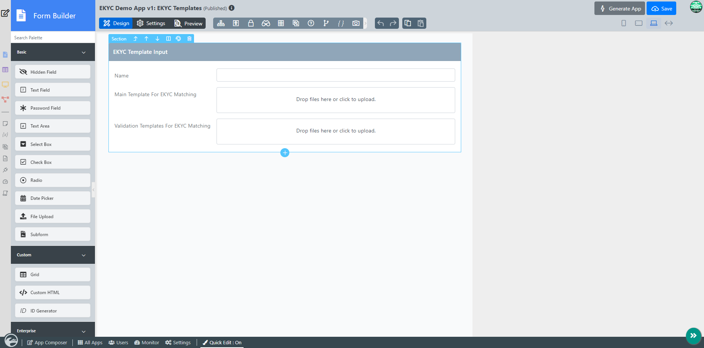 |
      | :-------------------------------------------------------------------: |
      |                               figure 3                                |

      Refering to the example in **figure 3**, there are **2 mandatory fields** :-

      - #### Main Template For eKYC Matching (File Upload Field)
        ```
        Admins will be able to upload their document in this File Upload Field.
        Here, the document uploaded by the admin will be the main template used for Template Matching.
        Example of main template shown in figure 7.
        ```
      - #### Validation Template For eKYC Matching (Multiple File Upload Field)
        ```
        Admins will be able to upload their document in this File Upload Field.
        Here, the documents uploaded by the admin will be used as a sub-template for validation on your main template.
        Example of validation template shown in figure 8, 9, 10.
        ```

4.  Be sure to generate an Application with `List` and `CRUD` for both the Forms created in `step 3`.

    | 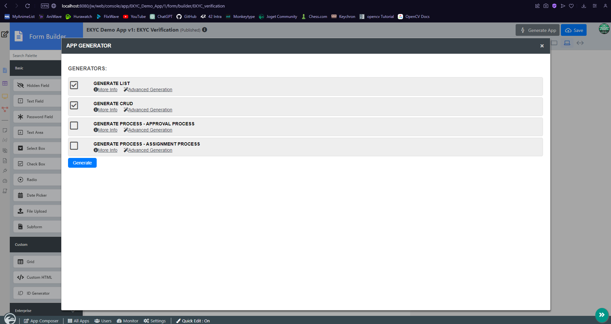 |
    | :-----------------------------------------------------------: |
    |                           figure 4                            |

5.  In the List Builder, edit the `eKYC Template List` and add an `ID` element into the List.

    | 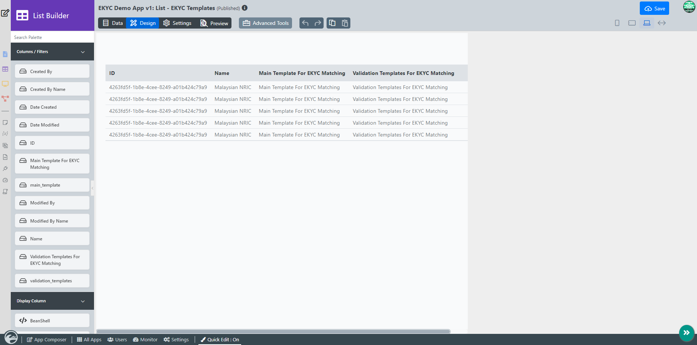 |
    | :----------------------------------------------------------: |
    |                           figure 5                           |

    #### Refering to the example shown in figure 5 :-

    ```
    We will need this ID to let the eKYC Process Tool know which template we want to use for the Template Matching.
    Admins can create multiple eKYC Templates to handle more than one Document.
    This ID will be used to identify each of them.
    ```

6.  Now that we've created the Application, we will need to provide a Template for eKYC verification.
    </br> Run the Application and upload a new Template, Refer to **figure 6** for an example.

    | 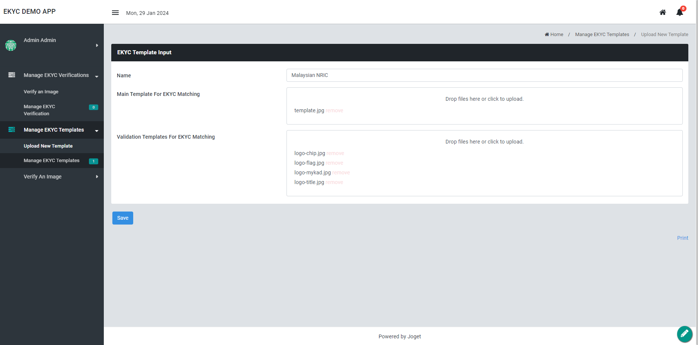 |
    | :--------------------------------------------------: |
    |                       figure 6                       |

    ### What is a Main Template and a Validation Template?

    - ## Main Template

      |  |
      | :----------------------------------------------------: |
      |                        figure 7                        |

      #### Refering to the example shown in figure 7 :-

      ```
      - Main Template is a cropped image of your document which you want to run the eKYC Process Tool on.
      - For better result accuracy, your document should have around 3-5% padding on all sides.
      - The higher the accuracy, the better the result of Template matching.
      ```

    - ## Validation Template

      |  |  |  |
      | :-------------------------------------------------: | :--------------------------------------------------: | :--------------------------------------------------: |
      |                      figure 8                       |                       figure 9                       |                      figure 10                       |

      #### Refering to the example shown in figure 8, 9, 10 :-

      ```
      - Validation Templates are areas in your main template which you want to run template matching on.
      - This is to verify whether the User submitted document is valid or not.
      - If ONE of the validation template result returns false, this means that the user submitted a forged document or the admin submitted template is faulty.
      - For better accuracy, your validation template should be cropped directly from your main template. Do not resize or crop from another image.
      ```

7.  Save the template and **copy** the `ID` Generated. We will need this `ID` for our eKYC Process Tool configuration.

    | 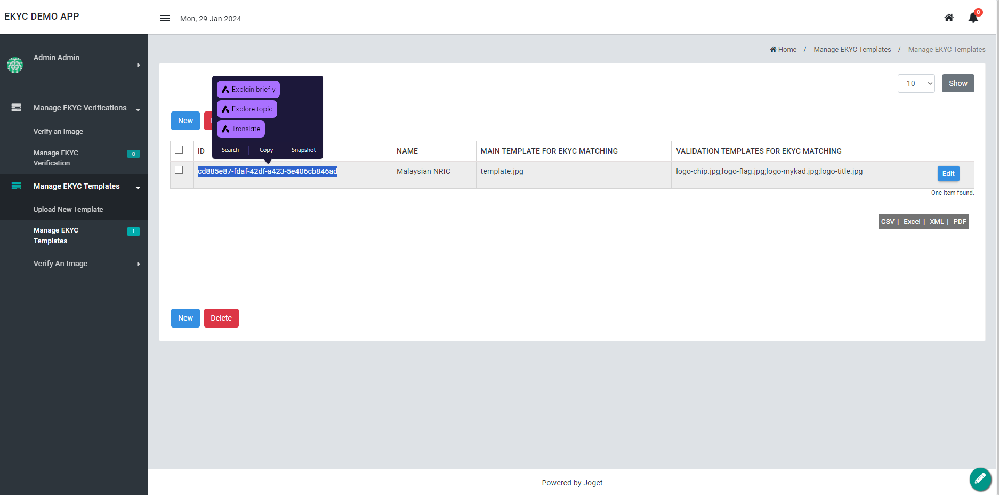 |
    | :-------------------------------------------: |
    |                   figure 11                   |

8.  Now in the **App Composer**, edit the `User Input Form` in the Form Builder section.
    </br> Navigate to `Settings > Advanced >  Post Form Submission Processing > Post Processing Tool` and select the `EKYC Process Tool`.
    </br> Refer to **figure 12 and 13** for eKYC Process Tool Configuration example :-

    | 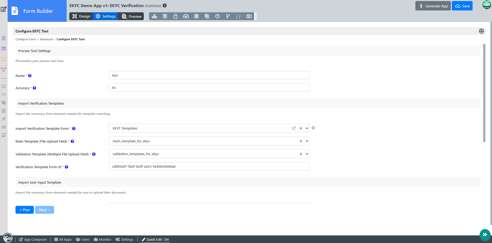 |
    | :-------------------------------------------------------: |
    |                         figure 12                         |

    | 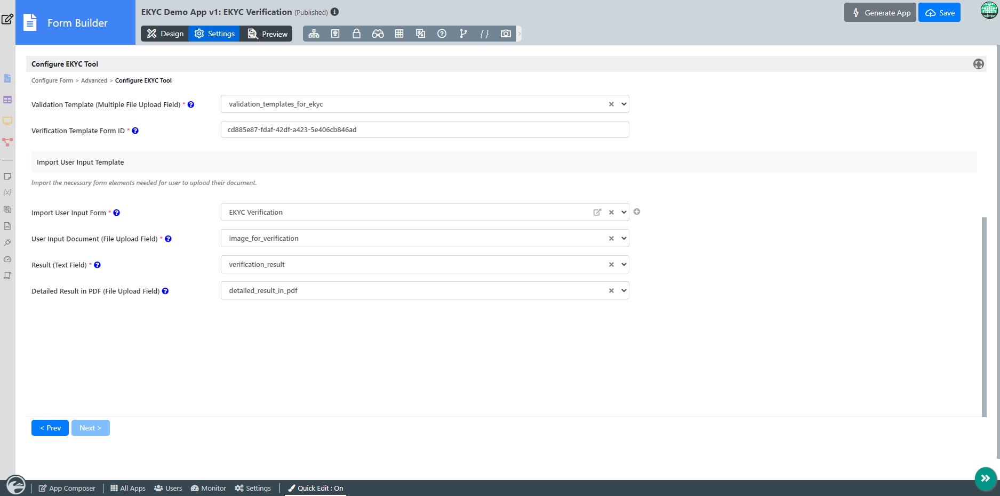 |
    | :-------------------------------------------------------: |
    |                         figure 13                         |

    #### Refering to the example in figure 12 :-

    ```
    - Paste the ID you copied into the Verification Template Form ID field.
    ```

9.  Save the configuration and **test** the application.
    </br> Upload an image and **submit** the form.
    </br> Refer to the Example shown in **figure 14**.

    | 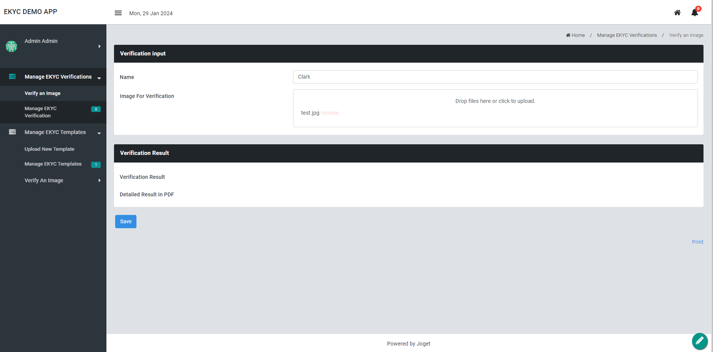 |
    | :---------------------------------: |
    |              figure 14              |

10. Check the results and view the detailed results in PDF. Have Fun!
    </br> Refer to **figure 15** for result example :-

    | 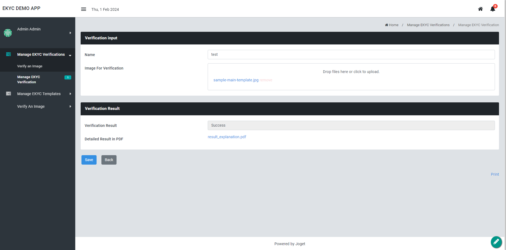 |
    | :------------------------: |
    |         figure 15          |

    #### Refering to the example in figure 15 :-

    - Here is an example of [`result_explanation.pdf`](src/result_explanation.pdf). (Content may change in future)

# eKYC Process Tool Plugin Contributors

- [`joekeroo`](https://github.com/joekeroo)
- [`JordieYen`](https://github.com/JordieYen)
